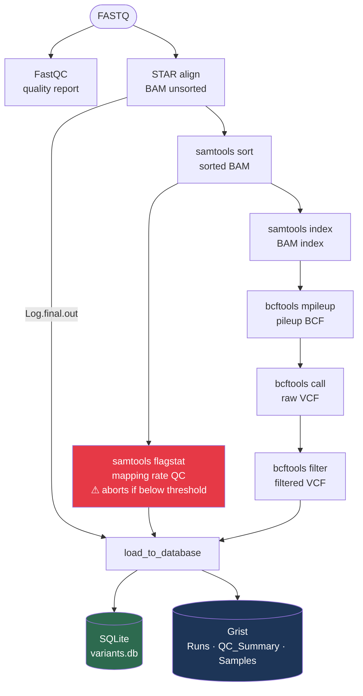
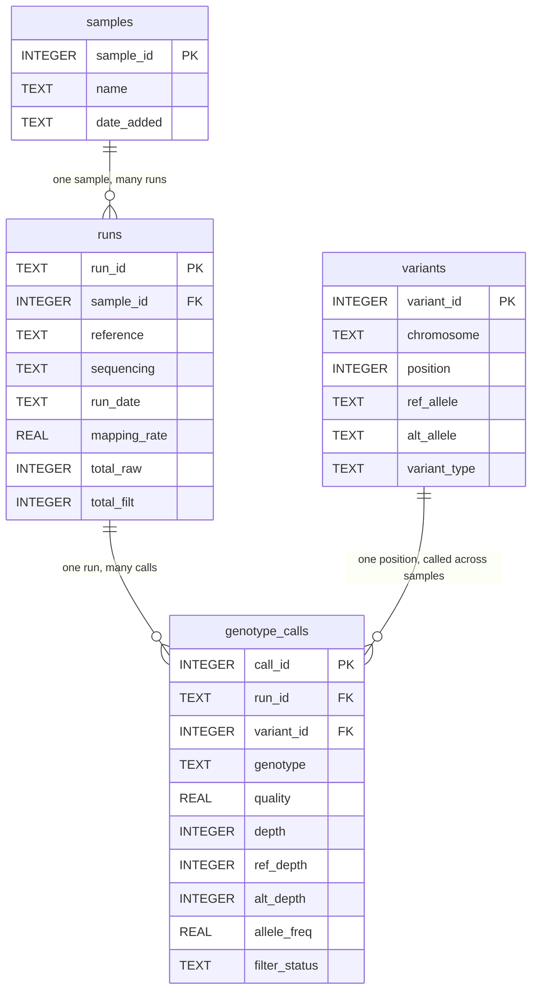
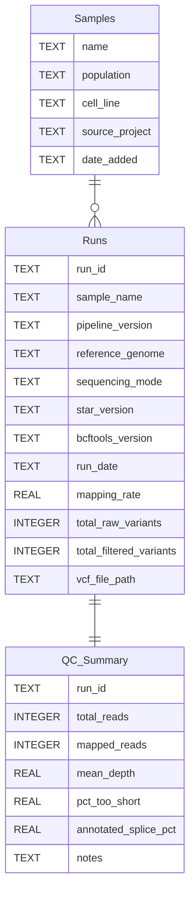

# scRNA-seq Variant Calling Pipeline

A Snakemake pipeline for quality control, alignment, variant calling, and database loading from RNA-seq reads (single-end or paired-end).

## Pipeline overview



## Database structure

The pipeline writes to two separate databases:

- **SQLite** (`results/variants.db`) — lives on the server. Stores the full variant data for programmatic queries.
- **Grist** — the web-based spreadsheet. Stores run summaries and QC metrics for human review.

> **PK** (Primary Key) = the unique ID that identifies each row in a table.
> **FK** (Foreign Key) = a reference to the PK of another table, used to link rows across tables.

### SQLite — full variant storage



### Grist — run summaries and QC



## Dependencies

- [Snakemake](https://snakemake.readthedocs.io) >= 7
- [STAR](https://github.com/alexdobin/STAR)
- [FastQC](https://www.bioinformatics.babraham.ac.uk/projects/fastqc/)
- [samtools](http://www.htslib.org/)
- [bcftools](http://www.htslib.org/)
- [cyvcf2](https://github.com/brentp/cyvcf2)
- [grist_api](https://github.com/gristlabs/grist-api)
- [python-dotenv](https://github.com/theskumar/python-dotenv)

All managed via conda — see Setup below.

## Project structure

```
scrna_project/
├── config/
│   └── config.yaml          # all run parameters — edit this before each run
├── workflow/
│   └── Snakefile
├── scripts/
│   ├── load_to_db.py        # loads results into SQLite and Grist
│   └── test_grist.py        # inspect Grist table schema
├── data/
│   ├── reference/           # genome FASTA, GTF, and STAR indices
│   └── <sample>/            # one folder per sample: <sample>_1.fastq [_2.fastq]
├── results/
│   ├── <run_id>/            # all outputs isolated per run
│   │   ├── fastqc/
│   │   ├── star/<sample>/
│   │   ├── bam/
│   │   ├── vcf/
│   │   └── db/              # touch files confirming db load completed
│   └── variants.db          # SQLite database accumulating all runs
├── logs/
│   └── <run_id>/            # logs mirror the results structure
├── .env                     # API credentials — never committed
└── .env.example             # template showing which variables are needed
```

## Setup

### 1. Conda environment

```bash
conda env create -f environment.yml
conda activate scrna
```

Activate at the start of every session before running the pipeline.

### 2. API credentials

Copy `.env.example` to `.env` and fill in your values:

```bash
cp .env.example .env
```

```bash
# .env
export GRIST_SERVER=https://your-grist-instance.example.com
export GRIST_API_KEY=your_api_key_here
export GRIST_DOC_ID=your_doc_id_here
```

Source the file before running the pipeline:

```bash
source .env
```

The `.env` file is in `.gitignore` and will never be committed. The SQLite database (`results/variants.db`) is also ignored.

## Running the pipeline

Place your FASTQ files in a folder under `data/` and run:

```bash
source .env && python run_pipeline.py --run-id MY_RUN --sample MY_SAMPLE
```

The pipeline runs **in the background by default** — it detaches from your terminal so it keeps running even if you close your laptop or the SSH connection drops. Output is written to `logs/nohup_<sample>.log`. Results land in `results/<run-id>/`. Previous runs are never touched.

Check progress at any time:

```bash
tail -f logs/nohup_MY_SAMPLE.log
```

### Options

**Single sample** (use `--sample` + `--run-id`):
```
--sample ID         sample ID matching the FASTQ filename prefix (required)
--run-id ID         unique label for this run — outputs go to results/<run-id>/
--fastq-dir PATH    FASTQ directory (default: data/<sample>)
```

**Batch** (use `--samples` + `--run-id-suffix`):
```
--samples ID ...    one or more sample IDs — run-id is auto-generated as {sample}{suffix}
--run-id-suffix S   suffix appended to each sample ID to form the run ID (e.g. _hg38)
```

**Common options:**
```
--sequencing        paired or single (default: single)
--cores             number of CPU cores (default: 16)
--db PATH           SQLite database file (default: results/variants.db)
--no-db             skip database loading entirely (useful for test/holdout samples)
--force             re-run all steps even if outputs already exist
--rerun-incomplete  re-run jobs with incomplete outputs from a previous failed run
--foreground        run in the terminal instead of detaching (single sample only)
-n/--dry-run        show what would run without executing anything
```

**Reference overrides** (optional — defaults to the hg38 reference in `data/reference/`):
```
--reference PATH          reference genome FASTA
--gtf PATH                annotation GTF
--star-index PATH         STAR index directory
--sjdb-overhang N         splice junction overhang = read_length - 1 (default: 74 for 75bp reads)
--genome-sa-index-nbases  STAR genome index SA size; 14 for full genome, 11 for small references (default: 14)
```

### Examples

```bash
# single sample — detaches immediately, safe to close laptop
source .env && python run_pipeline.py --run-id SRR5071697_hg38 --sample SRR5071697

# batch — runs samples sequentially, all detached, logs to logs/batch.log
source .env && python run_pipeline.py \
    --samples SRR5071662 SRR5071667 SRR5071672 SRR5071691 \
    --run-id-suffix _hg38

# batch with --no-db for test/holdout samples
source .env && python run_pipeline.py \
    --samples SRR5071692 \
    --run-id-suffix _hg38 \
    --no-db

# dry run — shows what would execute without running anything
python run_pipeline.py --run-id SRR5071686_hg38 --sample SRR5071686 --dry-run

# force re-run of all steps (e.g. after pipeline changes)
source .env && python run_pipeline.py --run-id SRR5071686_hg38 --sample SRR5071686 --force

# run in foreground to watch output live (e.g. for debugging)
source .env && python run_pipeline.py --run-id SRR5071686_hg38 --sample SRR5071686 --foreground
```

Check batch progress:
```bash
tail -f logs/batch.log
```

### Running only the database step

If upstream results already exist (e.g. adding a sample that was processed before the db step was introduced), call the loading script directly — no need to re-run the full pipeline:

```bash
source .env && conda run -n scrna python scripts/load_to_db.py \
    --run-id MY_RUN \
    --sample MY_SAMPLE \
    --vcf results/MY_RUN/vcf/MY_SAMPLE.filtered.vcf \
    --flagstat results/MY_RUN/bam/MY_SAMPLE.flagstat.txt
```

Re-running this script for an existing run is safe — it removes any previous Grist entries for that run before inserting, so no duplicates are created.

### Matching an unknown VCF against the database

To identify which sample an unknown VCF belongs to:

```bash
conda run -n scrna python scripts/match_vcf.py --vcf path/to/unknown.vcf
```

Reports all samples that share at least 40% of the query's variants. Options:

```
--vcf PATH         path to the unknown VCF (required)
--db PATH          SQLite database (default: results/variants.db)
--min-match N      minimum match % to report (default: 40)
--metric           overlap: shared/query total; jaccard: shared/union (default: overlap)
```

## Preparing input data

### FASTQ files

Place reads in a dedicated folder, one folder per sample. For single-end data the pipeline accepts either `<sample>.fastq` or `<sample>_1.fastq`. For paired-end both `_1` and `_2` files are required:

```
data/
└── MY_SAMPLE/
    ├── MY_SAMPLE.fastq        # single-end (or MY_SAMPLE_1.fastq)
    ├── MY_SAMPLE_1.fastq      # paired-end R1
    └── MY_SAMPLE_2.fastq      # paired-end R2
```

### Reference files

Put the genome FASTA and GTF in `data/reference/`. The STAR index is built automatically on first run if the directory does not exist:

```
data/reference/
├── genome.fa
├── genes.gtf
└── star_index_hg38_oh99/   # built automatically; name encodes genome + overhang
```

Naming convention: `star_index_<genome>_oh<overhang>`, where overhang = read length − 1.

### Changing read length or genome

Pass the values on the command line — no need to edit any files:

```bash
# 100bp reads (overhang = read_length - 1)
source .env && python run_pipeline.py --run-id MY_RUN --sample MY_SAMPLE \
    --sjdb-overhang 99

# small/single-chromosome reference
source .env && python run_pipeline.py --run-id MY_RUN --sample MY_SAMPLE \
    --genome-sa-index-nbases 11
```

The defaults (74 for overhang, 14 for SA index) are set for 75bp reads against the full hg38 genome. STAR will print the recommended value if `--genome-sa-index-nbases` is wrong for your genome size.

## Outputs

| File | Description |
|---|---|
| `results/<run_id>/fastqc/<sample>_1_fastqc.html` | Per-read quality report |
| `results/<run_id>/bam/<sample>.sorted.bam` | Sorted, indexed alignment |
| `results/<run_id>/bam/<sample>.flagstat.txt` | Mapping rate summary |
| `results/<run_id>/vcf/<sample>.raw.vcf` | Unfiltered variants |
| `results/<run_id>/vcf/<sample>.filtered.vcf` | Final filtered variants |
| `results/<run_id>/db/<sample>.loaded` | Touch file confirming db load completed |
| `results/variants.db` | SQLite database with all runs, variants, and genotype calls |

## Tuning parameters

| Parameter | Default | Effect |
|---|---|---|
| `samtools.min_mapping_rate` | 85 | Pipeline aborts if mapping rate falls below this (%) |
| `bcftools.min_base_quality` | 20 | Minimum base quality to count a read at a position |
| `bcftools.min_mapping_quality` | 20 | Minimum mapping quality to include a read |
| `filters.min_qual` | 30 | Minimum variant quality score (QUAL in VCF) |
| `filters.min_depth` | 10 | Minimum read depth at a variant site |
| `db_path` | `results/variants.db` | SQLite database file location |
