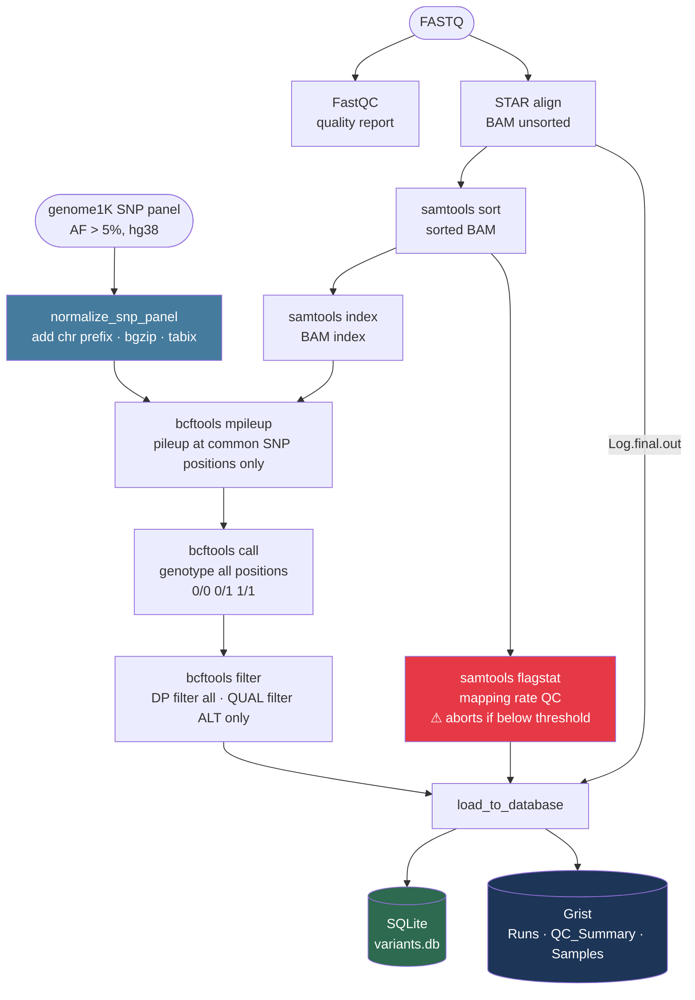
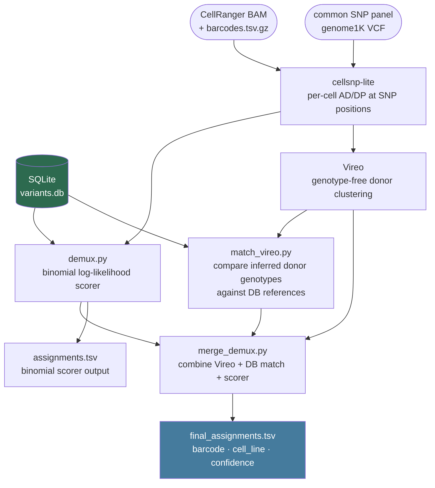
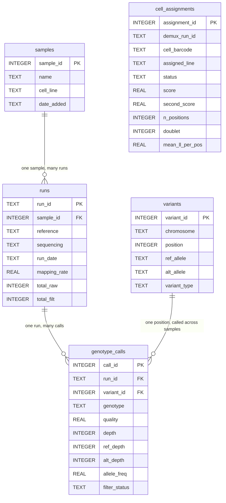
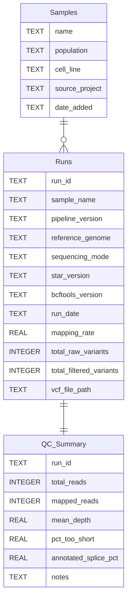

# scRNA-seq Variant Calling & Demultiplexing Pipeline

A Snakemake pipeline for quality control, alignment, genotyping at common SNP
positions, database loading, and cell line demultiplexing from RNA-seq reads
(single-end or paired-end).

## Pipeline overview



### What changed from v1

| v1 | v2 |
|---|---|
| Genome-wide variant discovery | Genotyping at ~7M common SNP positions (AF > 5%) only |
| Only ALT calls stored | 0/0 (ref/ref) calls also stored — informative for sparse scRNA-seq |
| QUAL filter applied to all sites | QUAL filter applies to ALT calls only; DP filters everything |
| `.filtered.vcf` output | `.genotyped.vcf` output |
| Silent overwrite on re-load | Duplicate `run_id` errors immediately; use `--force` to overwrite |

## Demultiplexing overview

After cell lines are characterised and loaded into the database, CellRanger
BAMs from pooled experiments can be demultiplexed against those reference
genotypes.

The scRNA demux pipeline runs four steps:



**Step 1 — cellsnp-lite**: pileup at common SNP positions, one row per cell barcode.

**Step 2 — demux.py** (binomial scorer): scores each cell against every reference
profile in the DB using log-likelihoods. Fast, reference-dependent — all target
cell lines must already be in the DB.

**Step 3 — Vireo**: genotype-free donor clustering. Groups cells into donor
clusters without any prior knowledge of the genotypes. Produces an inferred
genotype per cluster (anonymous donor0, donor1, …).

**Step 4 — match_vireo.py + merge_demux.py**: compares each Vireo donor's inferred
genotype against the DB references (full genotype concordance at common SNP positions). Optionally enforces
one-to-one donor↔cell-line matching (`--unique`, Hungarian algorithm) to prevent
the same reference from being claimed by multiple donors. The final merged table
combines Vireo identity, DB concordance, and binomial scorer output.

## Database structure

The pipeline writes to two separate databases:

- **SQLite** (`results/variants.db`) — lives on the server. Stores the full
  genotype data for programmatic queries and demultiplexing.
- **Grist** — the web-based spreadsheet. Stores run summaries and QC metrics
  for human review.

> **PK** (Primary Key) = the unique ID that identifies each row in a table.
> **FK** (Foreign Key) = a reference to the PK of another table.

### SQLite — genotype storage and cell assignments



### Grist — run summaries and QC



## Dependencies

- [Snakemake](https://snakemake.readthedocs.io) >= 7
- [STAR](https://github.com/alexdobin/STAR)
- [FastQC](https://www.bioinformatics.babraham.ac.uk/projects/fastqc/)
- [samtools](http://www.htslib.org/)
- [bcftools](http://www.htslib.org/) (with tabix)
- [cellSNP-lite](https://cellsnp-lite.readthedocs.io) — per-cell pileup for demultiplexing
- [vireoSNP](https://vireosnp.readthedocs.io) — genotype-free donor clustering for pooled scRNA-seq
- [cyvcf2](https://github.com/brentp/cyvcf2)
- [scipy](https://scipy.org/) — sparse matrix operations and Hungarian matching
- [numpy](https://numpy.org/)
- [grist_api](https://github.com/gristlabs/grist-api)
- [python-dotenv](https://github.com/theskumar/python-dotenv)

All managed via conda — see Setup below.

## Project structure

```
scrna_project/
├── config/
│   └── config.yaml              # all run parameters — edit before each run
├── workflow/
│   ├── Snakefile
│   └── chr_name_conv.txt        # bare → chr-prefixed chrom name mapping
├── scripts/
│   ├── load_to_db.py            # loads results into SQLite and Grist
│   ├── demux.py                 # cell line demultiplexer (binomial scorer)
│   ├── match_vireo.py           # match Vireo donor genotypes against DB references
│   ├── merge_demux.py           # merge Vireo + DB-match + scorer into final output
│   ├── validate_vcf.py          # hg38/hg19 detection for external VCFs
│   ├── match_vcf.py             # match an unknown VCF against the database
│   └── test_grist.py            # inspect Grist table schema
├── data/
│   └── cell_line_map.csv        # Run (SRR accession) → cell_line mapping for auto-labelling
├── data/
│   ├── reference/               # genome FASTA, GTF, STAR index, and SNP panel
│   └── <sample>/                # one folder per sample: <sample>_1.fastq [_2.fastq]
├── results/
│   ├── <run_id>/                # all outputs isolated per run
│   │   ├── fastqc/
│   │   ├── star/<sample>/
│   │   ├── bam/
│   │   ├── vcf/
│   │   └── db/                  # touch files confirming db load completed
│   ├── demux/<demux_run_id>/    # demultiplexing outputs
│   │   ├── cellsnp/             # cellSNP-lite per-cell pileup
│   │   └── assignments.tsv      # cell barcode → cell line assignments
│   └── variants.db              # SQLite database accumulating all runs
├── logs/
│   └── <run_id>/                # logs mirror the results structure
├── .env                         # API credentials — never committed
└── .env.example                 # template showing which variables are needed
```

## Setup

### 1. Conda environment

```bash
conda env create -f environment.yml
conda activate scrna
```

Activate at the start of every session before running the pipeline.

### 2. API credentials

Copy `.env.example` to `.env` and fill in your values:

```bash
cp .env.example .env
```

```bash
# .env
export GRIST_SERVER=https://your-grist-instance.example.com
export GRIST_API_KEY=your_api_key_here
export GRIST_DOC_ID=your_doc_id_here
```

Source the file before running the pipeline:

```bash
source .env
```

The `.env` file is in `.gitignore` and will never be committed. The SQLite
database (`results/variants.db`) is also ignored.

### 3. One-time SNP panel setup

The pipeline restricts variant calling to ~7M common SNP positions from the
1000 Genomes Project (AF > 5%, hg38). The raw VCF uses bare chromosome names
(`1`, `2`, `X`) which need to be converted to match the pipeline reference
(`chr1`, `chr2`, `chrX`). This is done once:

```bash
# Set common_snps_source in config.yaml to the path of the genome1K VCF,
# then run just the normalization rule:
snakemake data/reference/genome1K.hg38.common_snps.vcf.gz
```

This produces a bgzipped, tabix-indexed VCF at `data/reference/genome1K.hg38.common_snps.vcf.gz`.
Subsequent pipeline runs use this file directly — the rule only re-runs if the
source VCF changes.

## Running the pipeline

`run_pipeline.py` has two modes selected with `--mode`:

| Mode | What it does |
|---|---|
| `bulk` (default) | FASTQ → align → genotype at common SNPs → load to DB. Builds reference genotypes for known cell lines. |
| `scrna` | BAM → cellsnp-lite → demux scorer → `assignments.tsv`. Assigns cell barcodes from a pooled experiment to cell lines already in the DB. |

Both modes run **in the background by default** — the process detaches so it
keeps running if you close the terminal.

### Bulk mode

Place FASTQ files under `data/<sample>/` and run:

```bash
source .env && python run_pipeline.py --mode bulk --run-id MY_RUN --sample MY_SAMPLE
```

**Single sample options:**
```
--sample ID         sample ID matching the FASTQ filename prefix (required)
--run-id ID         unique label for this run — outputs go to results/<run-id>/
--fastq-dir PATH    FASTQ directory (default: data/<sample>)
```

**Batch options** (use `--samples` + `--run-id-suffix`):
```
--samples ID ...    one or more sample IDs — run-id is auto-generated as {sample}{suffix}
--run-id-suffix S   suffix appended to each sample ID to form the run ID (e.g. _hg38)
```

**Common options:**
```
--sequencing        paired or single (default: single)
--cores             number of CPU cores (default: 16)
--db PATH           SQLite database file (default: results/variants.db)
--notify-email ADDR send an email when the batch finishes or fails (requires server mail)
--no-db             skip database loading entirely (useful for test/holdout samples)
--force             re-run all steps even if outputs already exist
--rerun-incomplete  re-run jobs with incomplete outputs from a previous failed run
--foreground        run in the terminal instead of detaching
-n/--dry-run        show what would run without executing anything
```

**Reference overrides** (optional — defaults to the hg38 reference in `data/reference/`):
```
--reference PATH          reference genome FASTA
--gtf PATH                annotation GTF
--star-index PATH         STAR index directory
--sjdb-overhang N         splice junction overhang = read_length - 1 (default: 74 for 75bp reads)
--genome-sa-index-nbases  STAR genome index SA size; 14 for full genome, 11 for small references (default: 14)
```

**Bulk examples:**

```bash
# single sample — detaches immediately, safe to close laptop
source .env && python run_pipeline.py --mode bulk --run-id SRR5071697_hg38 --sample SRR5071697

# batch — runs samples sequentially, all detached, logs to logs/batch.log
source .env && python run_pipeline.py --mode bulk \
    --samples SRR5071662 SRR5071667 SRR5071672 SRR5071691 \
    --run-id-suffix _hg38

# batch with --no-db for test/holdout samples
source .env && python run_pipeline.py --mode bulk \
    --samples SRR5071692 --run-id-suffix _hg38 --no-db

# dry run — shows what would execute without running anything
python run_pipeline.py --mode bulk --run-id SRR5071686_hg38 --sample SRR5071686 --dry-run

# force re-run of all steps (e.g. after pipeline changes)
source .env && python run_pipeline.py --mode bulk --run-id SRR5071686_hg38 --sample SRR5071686 --force
```

Check batch progress:
```bash
tail -f logs/batch.log
```

### Duplicate run IDs

Each `run_id` must be unique in the database. Attempting to load the same
`run_id` twice will fail immediately with a clear error message. To
intentionally overwrite an existing run (all previous data for that run_id is
deleted first):

```bash
source .env && python scripts/load_to_db.py --run-id MY_RUN ... --force
```

### Running only the database step

If upstream results already exist, call the loading script directly:

```bash
source .env && conda run -n scrna python scripts/load_to_db.py \
    --run-id MY_RUN \
    --sample MY_SAMPLE \
    --vcf results/MY_RUN/vcf/MY_SAMPLE.genotyped.vcf \
    --flagstat results/MY_RUN/bam/MY_SAMPLE.flagstat.txt
```

For a VCF produced outside this pipeline, add `--external-vcf` to trigger
reference genome validation (hg38 vs hg19 detection and chromosome naming
check) before loading:

```bash
source .env && conda run -n scrna python scripts/load_to_db.py \
    --run-id MY_RUN \
    --sample MY_SAMPLE \
    --vcf /path/to/external.vcf \
    --flagstat /path/to/flagstat.txt \
    --external-vcf
```

### Validating an external VCF

To check whether a VCF is aligned to hg38 (required by this pipeline) before
using it:

```bash
conda run -n scrna python scripts/validate_vcf.py path/to/sample.vcf.gz
```

Reports the detected reference build, chromosome naming style, and any issues.
If the VCF was called against hg19/GRCh37, it will fail with a clear message
and a suggested liftover command. Use `--allow-hg19` to inspect without
failing (e.g. to confirm detection is correct before converting).

### Matching an unknown VCF against the database

To identify which sample an unknown VCF belongs to:

```bash
conda run -n scrna python scripts/match_vcf.py --vcf path/to/unknown.vcf
```

Reports all samples that share at least 40% of the query's variants. Options:

```
--vcf PATH         path to the unknown VCF (required)
--db PATH          SQLite database (default: results/variants.db)
--min-match N      minimum match % to report (default: 40)
--metric           overlap: shared/query total; jaccard: shared/union (default: overlap)
```

## Demultiplexing scRNA-seq data

Use `--mode scrna` to assign cell barcodes from a pooled scRNA-seq experiment
to the cell lines they came from. All reference cell lines must already be in
the database — run `--mode bulk` for each line first.

The scrna mode runs two steps: **cellsnp-lite** (pileup at common SNP positions
per cell barcode), then the **demux scorer** (binomial log-likelihood match
against reference genotypes in the DB).

### scRNA mode options

```
--bam PATH              BAM file from CellRanger or STARsolo — triggers cellsnp-lite
--barcodes PATH         barcodes.tsv.gz matching the BAM (required with --bam)
--cellsnp-dir PATH      use an existing cellsnp-lite output dir, skip cellsnp step
--demux-run-id ID       unique label for this demux run (required)
--run-ids ID ...        run_ids in the DB to compare against; default: all
--load-db               write binomial scorer assignments to the SQLite database
--n-donors N            number of donors to cluster in Vireo (default: auto-detect)
--min-concordance F     min genotype concordance for a Vireo donor→DB match (default: 0.65)
--min-gap F             concordance gap between best and second-best to accept a match (default: 0.10)
--min-depth N           min reads at a position in a cell to use it (default: 1)
--min-positions N       min covered positions to attempt assignment (default: 200)
--doublet-gap F         min LL gap between top two lines for a singlet call (default: 2.0)
--no-match-threshold F  mean LL per position below which → no_match (default: -0.5)
--snps-vcf PATH         common SNP panel for cellsnp-lite (default: data/reference/genome1K.hg38.common_snps.vcf.gz)
--cores N               threads for cellsnp-lite (default: 16)
```

### scRNA examples

```bash
# from a CellRanger BAM — full pipeline: cellsnp → demux → vireo → match → merge
source .env && python run_pipeline.py --mode scrna \
    --bam data/Pool_ctr/possorted_genome_bam.bam \
    --barcodes data/Pool_ctr/barcodes.tsv.gz \
    --demux-run-id pool_ctr_001 \
    --n-donors 7

# from an existing cellsnp-lite output — skip cellsnp step
source .env && python run_pipeline.py --mode scrna \
    --cellsnp-dir data/Pool_ctr/cellsnp \
    --demux-run-id pool_ctr_001 \
    --n-donors 7

# restrict Vireo matching to only the expected cell lines in the pool
source .env && python run_pipeline.py --mode scrna \
    --cellsnp-dir data/Pool_ctr/cellsnp \
    --demux-run-id pool_ctr_001 \
    --n-donors 7 \
    --run-ids SRR5071686_hg38 SRR5071667_hg38 SRR5071672_hg38 \
              SRR5071669_hg38 SRR5071657_hg38 SRR5071662_hg38 SRR5071677_hg38
```

Follow progress:
```bash
tail -f logs/demux/pool_ctr_001.log
```

> **Missing references:** if some `--run-ids` are not found in the DB, the
> pipeline prints a warning and continues with the ones that are present. It
> only fails if *no* references are found at all. Leave `--run-ids` unset (the
> default) to automatically score against every run in the DB.

> **Restricting to pool composition:** when you know which cell lines are in
> the pool, pass their run_ids with `--run-ids`. This prevents spurious matches
> from unrelated lines in the DB and makes the gap threshold more meaningful.

### match_vireo.py options

Run directly for custom matching (e.g. re-run with different thresholds without
re-running Vireo):

```bash
conda run -n scrna python scripts/match_vireo.py \
    --vireo-dir results/demux/pool_ctr_001/vireo \
    --db results/variants.db \
    --run-ids SRR5071686_hg38 SRR5071667_hg38 SRR5071672_hg38 \
    --output results/demux/pool_ctr_001/donor_matches.tsv \
    --min-concordance 0.65 \
    --min-gap 0.10 \
    --unique
```

**`--unique`** enforces one-to-one donor↔reference matching via the Hungarian
algorithm. Without it, multiple donors can match the same reference (which can
happen when a reference cell line has many variants shared with others). Use
`--unique` whenever the composition of the pool is known (i.e. pass `--run-ids`
with exactly the expected cell lines).

The concordance metric is **full genotype concordance**: at all common SNP positions
where both the Vireo donor and the DB reference have a valid call, what fraction
have matching dosages (0/0=0/0, 0/1=0/1, 1/1=1/1)? This is variant-count-agnostic
— a reference sample with fewer ALT calls is not artificially favoured.

### Output files

| File | Description |
|---|---|
| `results/demux/<id>/assignments.tsv` | Binomial scorer: barcode → cell_line, status, score, n_positions |
| `results/demux/<id>/vireo/donor_ids.tsv` | Vireo per-cell donor assignment and probabilities |
| `results/demux/<id>/vireo/GT_donors.vireo.vcf.gz` | Vireo inferred donor genotypes |
| `results/demux/<id>/donor_matches.tsv` | Vireo donor → DB cell line concordance table |
| `results/demux/<id>/final_assignments.tsv` | **Main output** — merged Vireo + DB + scorer per cell |

`final_assignments.tsv` columns:

```
barcode           cell_line  source    vireo_donor  prob_max  prob_doublet  concordance  n_positions  match_confidence  scorer_assignment  scorer_status  agreement
ACGTACGT-1        RKO        db_match  donor2       1.0       1e-52         0.8242       9932         high              RKO_hg38           assigned       TRUE
TTGCAACG-1        HCT116     db_match  donor6       1.0       1e-18         0.7053       13464        high              HCT116_hg38        assigned       TRUE
CGTAGCTA-1        DLD1       db_match  donor4       0.98      2e-08         0.3444       14935        low               DLD1_hg38          assigned       TRUE
AAGTCCAA-1        doublet:RKO+HCT116  doublet  donor2   0.61   0.39         ...
TTACGGCC-1        unassigned  unassigned  unassigned  ...
```

**`match_confidence` values:**

| Value | Meaning |
|---|---|
| `high` | concordance ≥ `min_concordance` and gap ≥ `min_gap` — clear match |
| `low` | concordance below threshold or gap too small — best available match from 1:1 assignment; treat with caution |
| `no_match` | no reference with sufficient shared positions |
| `no_data` | fewer than `min_positions` shared positions |

**`source` values:**

| Value | Meaning |
|---|---|
| `db_match` | Vireo donor was matched to a DB reference |
| `vireo_only` | Vireo donor had no DB match — labelled `vireo:<donor_id>` |
| `doublet` | Vireo flagged this cell as a doublet; constituent donors resolved to cell line names where possible |
| `unassigned` | Vireo could not assign this cell to any donor |

**`agreement`**: `TRUE` when the binomial scorer and Vireo-based assignment agree on the same cell line.

### Cell line auto-labelling

When running bulk mode, the pipeline looks up cell line names from
`data/cell_line_map.csv` (mapped from `Run` column to `cell_line` column) and
passes them to `load_to_db.py --cell-line`. The cell line name is stored in the
`samples.cell_line` column in SQLite — it does **not** replace the original
sample name (stored in `samples.name`).

To backfill cell line labels for existing DB entries:

```python
import sqlite3, csv
conn = sqlite3.connect("results/variants.db")
with open("data/cell_line_map.csv") as f:
    for row in csv.DictReader(f):
        r = conn.execute("SELECT sample_id FROM samples WHERE name=?", (row["Run"],)).fetchone()
        if r:
            conn.execute("UPDATE samples SET cell_line=? WHERE sample_id=?", (row["cell_line"], r[0]))
conn.commit()
```

### Backfilling 0/0 calls for legacy runs

Reference runs loaded before the current pipeline version may only have ALT calls in the
DB (their `bcftools mpileup` was run without `-T`, genome-wide, and `bcftools call` used
`--variants-only` or equivalent). These runs miss the 0/0 information that makes the
concordance metric variant-count-agnostic.

If the original `.mpileup.bcf` is still on disk (check `results/<run_id>/vcf/`), you can
retroactively add 0/0 calls without re-aligning:

```bash
# Preview what would be done (no changes):
python scripts/backfill_panel_genotypes.py --dry-run

# Run for all runs currently missing 0/0 in the DB:
python scripts/backfill_panel_genotypes.py

# Or for specific runs only:
python scripts/backfill_panel_genotypes.py --run-ids SRR5071667_hg38 SRR5071672_hg38
```

The script:
1. Runs `bcftools call -m -T <panel>` on the existing mpileup BCF — restricts output to
   SNP panel positions and emits both 0/0 and ALT calls (same filter thresholds as the
   pipeline: DP < 10 or QUAL < 30 for non-ref calls).
2. Deletes the old `genotype_calls` rows for that `run_id` in SQLite.
3. Reloads from the new VCF.

Run metadata (mapping rate, Grist records) is not changed. New VCFs are written to
`results/<run_id>/vcf/<sample>.panel_genotyped.vcf`.

After the backfill completes, re-run `match_vireo.py` for any affected pools and raise
`--min-concordance` to `0.80` (see threshold guidance below).

### How genotype matching works

After Vireo clusters cells into anonymous donors (donor0, donor1, …) and infers a
consensus genotype for each, `match_vireo.py` identifies which cell line each donor is
by comparing those inferred genotypes against the reference genotypes stored in the DB.

**What is being compared**

For each (Vireo donor, DB reference) pair, the script compares full genotypes at every
common SNP position where both have a valid call. Genotype dosages are 0 (0/0), 1 (0/1),
or 2 (1/1); a missing/uncovered position gets dosage −1 and is excluded from the
comparison.

**The genotype concordance metric**

```
                  positions where BOTH have a valid call  AND  BOTH agree on ALT presence
concordance  =  ───────────────────────────────────────────────────────────────────────────────
                  positions where BOTH have a valid call
```

"ALT presence" means dosage > 0 (i.e. at least one copy of an ALT allele). Both 0/1 and
1/1 count as "ALT present"; 0/0 counts as "ALT absent". The het/hom distinction is
intentionally ignored — Vireo frequently calls truly homozygous-alt positions as
heterozygous due to low per-cell read depth, and penalising for that would unfairly lower
the concordance of true matches.

The pipeline genotypes all WES/WGS samples at every position in the 1000G common-SNP
panel (AF > 5%) using `bcftools mpileup -T`, retaining 0/0 (homozygous-ref) calls as
well as ALT calls. Vireo likewise outputs full genotypes at those same positions.
The intersection is typically tens of thousands of sites per comparison.

This metric is **variant-count-agnostic**: a reference sample with fewer ALT calls is no
longer artificially favoured. Positions where the true match has ALT and a wrong reference
has 0/0 count as mismatches, clearly distinguishing the wrong cell line.

**Graceful degradation for legacy DB entries**

Reference runs loaded before the current pipeline (i.e. without the `-T` panel filter in
`bcftools mpileup`) may only store ALT calls and have no 0/0 rows in the DB. For those
runs `r_valid` covers only ALT positions, so the metric reduces to the original ALT-recall.
Use `scripts/backfill_panel_genotypes.py` to retroactively add 0/0 calls from the existing
mpileup BCF (see below).

**Confidence tiers**

| Tier | Condition |
|---|---|
| `high` | concordance ≥ `min_concordance` **and** gap between best and second-best ≥ `min_gap` |
| `low` | concordance ≥ 0.7 × `min_concordance` — best available match but below the confidence bar |
| `no_match` | concordance too low at all references |
| `no_data` | fewer than `min_positions` shared positions with this donor |

**1:1 Hungarian matching (`--unique`)**

Without `--unique`, two donors can independently pick the same reference as their best
match (common when a reference cell line is genetically similar to several others).
`--unique` solves a maximum-weight bipartite matching (Hungarian algorithm) so each
reference is assigned to at most one donor — use it whenever the pool composition is known.

**Adding unmatched donors to the DB**

If a donor cannot be matched (confidence `no_match` or `no_data`), it likely represents
a cell line not yet in the DB. Pass `--add-unmatched` to `run_pipeline.py` (or run
`scripts/add_unmatched_donors.py` directly) to insert the donor's inferred genotype as a
new reference sample (`unknown_<run_id>_<donor_id>`, `cell_line = NULL`). Once you
identify the cell line, update the label:

```sql
UPDATE samples SET cell_line = 'IS3'
WHERE name = 'unknown_pool_ctr_v4_donor3';
```

### Tuning Vireo matching thresholds

- **`--min-concordance`**: the minimum genotype concordance to accept a Vireo→DB match.
  Two calibration regimes exist depending on DB state:
  - **Legacy DB (ALT calls only, no 0/0)**: use `0.65`. The metric reduces to ALT-recall
    and true matches score 0.65–0.85. Background (wrong-reference) scores are 0.30–0.55.
  - **Full DB (0/0 calls present, after backfill)**: use `0.80`. With the full denominator,
    true matches score 0.82–0.95 while the background rises to 0.65–0.75 (shared ref/ref
    positions inflate all scores). The `--min-gap` criterion is especially important here
    to guard against sparse-Vireo donors that score high against multiple references.
  Donors from small cell clusters (< 500 cells) may score lower due to sparse Vireo
  genotypes (mostly 0/0 calls); use `--unique` to still assign them.
- **`--min-gap`**: the minimum margin between best and second-best concordance.
  A gap of `0.10` is appropriate for the genotype-concordance metric; increase to
  `0.15` if you have very similar cell lines in the DB.
- **Small clusters**: donors with < 500 cells will typically receive
  `confidence=low`. The assignment is still the best available given the data
  — flag it in downstream analysis rather than discarding it.

### Advanced: Snakemake rules

For dependency-tracked runs (re-uses cellsnp output if it already exists),
configure `config.yaml` and call Snakemake directly:

```yaml
demux:
  # Explicit paths — use these for flat CellRanger output or STARsolo output.
  # Takes priority over cellranger_dir if set.
  bam: data/Pool_ctr/possorted_genome_bam.bam
  barcodes: data/Pool_ctr/barcodes.tsv.gz

  # CellRanger outs/ directory — auto-constructs paths from outs/ subdirectory.
  # Use this OR bam+barcodes, not both.
  cellranger_dir: null

  run_ids: []           # leave empty to score against all runs in DB
  demux_run_id: pool_ctr_001
  load_db: false
  threads: 8
  n_donors: null        # Vireo donor count; null = auto-detect
  min_concordance: 0.65  # min genotype concordance for Vireo→DB match
  min_gap: 0.10          # concordance gap required for a confident match
  min_depth: 1
  min_positions: 200
  doublet_gap: 2.0
  no_match_threshold: -0.5
```

```bash
snakemake results/demux/pool_ctr_001/assignments.tsv
```

### Tuning thresholds

- **`min_depth`**: for scRNA-seq, use `1` (default). Bulk-style `10` is too
  stringent — individual cells typically cover most positions at depth 1–3.
- **`min_positions`**: minimum covered positions before attempting an
  assignment. Use `10` for scRNA (default), `50` for bulk.
- **`doublet_gap`**: raise it (e.g. `5.0`) to flag more cells as doublets.
  With well-separated cell lines the LL gap for a true singlet is usually
  large (> 100), so `2.0` is conservative. Inspect `mean_ll_per_pos` first.
- **`no_match_threshold`**: typical mean LL per position for a good assignment
  is −1.0 to −1.5. Cells scoring much worse (e.g. < −3.0) are likely poor
  quality or from a line not in the DB.

## Exploring results in the notebook

Open `notebooks/01_explore_fastq.ipynb` with the `scrna` kernel active. The
notebook pulls data directly from SQLite — no manual configuration needed.

**Requirements** (install once if not already present):

```bash
conda run -n scrna pip install ipywidgets plotly jupyterlab
```

**Sections:**

| Section | What it shows |
|---|---|
| Cross-sample QC overview | Mapping rate (with 85% threshold), genotyped position counts, raw vs filtered comparison for every run |
| Per-run deep-dive | Dropdown to select a run — depth distribution, QUAL scores, variant types (SNP/INDEL), allele frequency spectrum, variants per chromosome, depth vs QUAL scatter |
| Cross-sample comparison | Two dropdowns — variant overlap, Jaccard similarity, side-by-side depth and allele frequency plots |
| STAR alignment QC | Annotated splice % and % reads too short per sample (read from STAR log files) |
| Raw SQL explorer | Text box to run any query against the database |

> **Note:** If the pipeline is actively loading results to the database in the
> background, notebook queries will hang until the write lock is released. Wait
> for the pipeline to finish (`tail -f logs/batch.log`), then run the notebook.

## Preparing input data

### FASTQ files

Place reads in a dedicated folder, one folder per sample. For single-end data
the pipeline accepts either `<sample>.fastq` or `<sample>_1.fastq`. For
paired-end both `_1` and `_2` files are required:

```
data/
└── MY_SAMPLE/
    ├── MY_SAMPLE.fastq        # single-end (or MY_SAMPLE_1.fastq)
    ├── MY_SAMPLE_1.fastq      # paired-end R1
    └── MY_SAMPLE_2.fastq      # paired-end R2
```

### Reference files

Put the genome FASTA and GTF in `data/reference/`. The STAR index is built
automatically on first run if the directory does not exist:

```
data/reference/
├── genome.fa
├── genes.gtf
├── star_index_hg38_oh99/              # built automatically
└── genome1K.hg38.common_snps.vcf.gz  # built by normalize_snp_panel (one-time)
```

Naming convention: `star_index_<genome>_oh<overhang>`, where overhang = read
length − 1.

### Changing read length or genome

Pass the values on the command line — no need to edit any files:

```bash
# 100bp reads (overhang = read_length - 1)
source .env && python run_pipeline.py --run-id MY_RUN --sample MY_SAMPLE \
    --sjdb-overhang 99

# small/single-chromosome reference
source .env && python run_pipeline.py --run-id MY_RUN --sample MY_SAMPLE \
    --genome-sa-index-nbases 11
```

The defaults (74 for overhang, 14 for SA index) are set for 75bp reads
against the full hg38 genome.

## Outputs

| File | Description |
|---|---|
| `results/<run_id>/fastqc/<sample>[_1]_fastqc.html` | Per-read quality report |
| `results/<run_id>/bam/<sample>.sorted.bam` | Sorted, indexed alignment |
| `results/<run_id>/bam/<sample>.flagstat.txt` | Mapping rate summary |
| `results/<run_id>/vcf/<sample>.raw.vcf` | Unfiltered genotypes at common SNP positions |
| `results/<run_id>/vcf/<sample>.genotyped.vcf` | Depth- and quality-filtered genotypes (0/0, 0/1, 1/1) |
| `results/<run_id>/vcf/<sample>.panel_genotyped.vcf` | Backfilled panel genotypes (created by `backfill_panel_genotypes.py` for legacy runs) |
| `results/<run_id>/db/<sample>.loaded` | Touch file confirming db load completed |
| `results/demux/<demux_run_id>/cellsnp/` | cellSNP-lite per-cell pileup directory |
| `results/demux/<demux_run_id>/vireo/` | Vireo donor clustering outputs |
| `results/demux/<demux_run_id>/assignments.tsv` | Binomial scorer: barcode → cell line |
| `results/demux/<demux_run_id>/donor_matches.tsv` | Vireo donor → DB reference concordance |
| `results/demux/<demux_run_id>/final_assignments.tsv` | Merged final cell line assignments |
| `results/variants.db` | SQLite database with all runs, genotype calls, and cell assignments |

## Tuning parameters

| Parameter | Default | Effect |
|---|---|---|
| `samtools.min_mapping_rate` | 85 | Pipeline aborts if mapping rate falls below this (%) |
| `bcftools.min_base_quality` | 20 | Minimum base quality to count a read at a position |
| `bcftools.min_mapping_quality` | 20 | Minimum mapping quality to include a read |
| `filters.min_qual` | 30 | Minimum QUAL score for ALT calls (0/0 positions are exempt) |
| `filters.min_depth` | 10 | Minimum read depth at any genotyped position |
| `demux.min_depth` | 10 | Minimum depth in a cell at a position to use it for scoring |
| `demux.min_positions` | 200 | Minimum covered positions to attempt cell assignment |
| `demux.doublet_gap` | 2.0 | Log-likelihood gap below which a cell is called a doublet |
| `demux.no_match_threshold` | −0.5 | Mean LL per position below which a cell gets no_match |
| `db_path` | `results/variants.db` | SQLite database file location |
