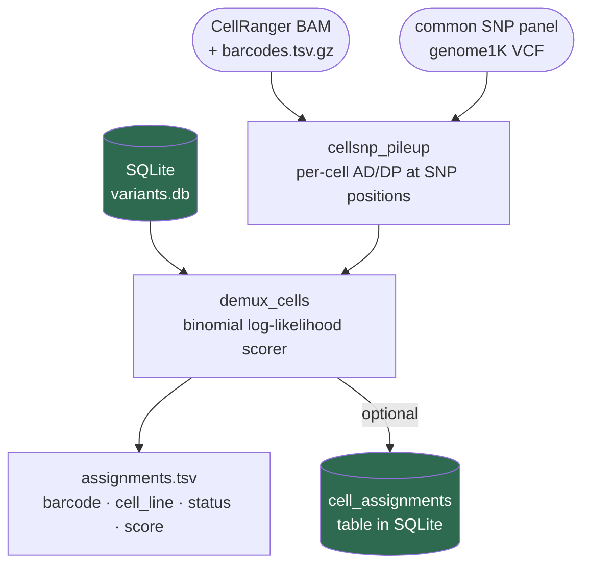
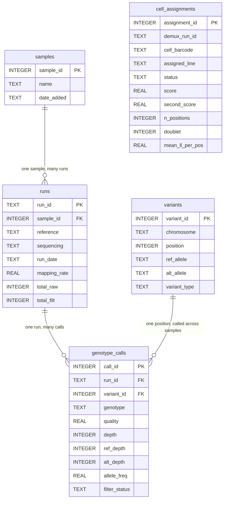
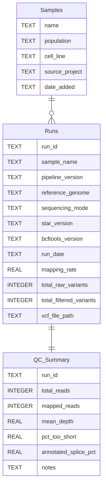

# scRNA-seq Variant Calling & Demultiplexing Pipeline

A Snakemake pipeline for quality control, alignment, genotyping at common SNP
positions, database loading, and cell line demultiplexing from RNA-seq reads
(single-end or paired-end).

## Pipeline overview


### What changed from v1

| v1 | v2 |
|---|---|
| Genome-wide variant discovery | Genotyping at ~7M common SNP positions (AF > 5%) only |
| Only ALT calls stored | 0/0 (ref/ref) calls also stored — informative for sparse scRNA-seq |
| QUAL filter applied to all sites | QUAL filter applies to ALT calls only; DP filters everything |
| `.filtered.vcf` output | `.genotyped.vcf` output |
| Silent overwrite on re-load | Duplicate `run_id` errors immediately; use `--force` to overwrite |

## Demultiplexing overview

After cell lines are characterised and loaded into the database, CellRanger
BAMs from pooled experiments can be demultiplexed against those reference
genotypes.



Each cell barcode is assigned to the best-matching cell line, or flagged as
`doublet` / `no_match`. No reference genotypes are inferred from the data —
all reference profiles must already be in the database.

## Database structure

The pipeline writes to two separate databases:

- **SQLite** (`results/variants.db`) — lives on the server. Stores the full
  genotype data for programmatic queries and demultiplexing.
- **Grist** — the web-based spreadsheet. Stores run summaries and QC metrics
  for human review.

> **PK** (Primary Key) = the unique ID that identifies each row in a table.
> **FK** (Foreign Key) = a reference to the PK of another table.

### SQLite — genotype storage and cell assignments



### Grist — run summaries and QC



## Dependencies

- [Snakemake](https://snakemake.readthedocs.io) >= 7
- [STAR](https://github.com/alexdobin/STAR)
- [FastQC](https://www.bioinformatics.babraham.ac.uk/projects/fastqc/)
- [samtools](http://www.htslib.org/)
- [bcftools](http://www.htslib.org/) (with tabix)
- [cellSNP-lite](https://cellsnp-lite.readthedocs.io) — per-cell pileup for demultiplexing
- [cyvcf2](https://github.com/brentp/cyvcf2)
- [scipy](https://scipy.org/) — sparse matrix operations in demux scorer
- [numpy](https://numpy.org/)
- [grist_api](https://github.com/gristlabs/grist-api)
- [python-dotenv](https://github.com/theskumar/python-dotenv)

All managed via conda — see Setup below.

## Project structure

```
scrna_project/
├── config/
│   └── config.yaml              # all run parameters — edit before each run
├── workflow/
│   ├── Snakefile
│   └── chr_name_conv.txt        # bare → chr-prefixed chrom name mapping
├── scripts/
│   ├── load_to_db.py            # loads results into SQLite and Grist
│   ├── demux.py                 # cell line demultiplexer (binomial scorer)
│   ├── validate_vcf.py          # hg38/hg19 detection for external VCFs
│   ├── match_vcf.py             # match an unknown VCF against the database
│   └── test_grist.py            # inspect Grist table schema
├── data/
│   ├── reference/               # genome FASTA, GTF, STAR index, and SNP panel
│   └── <sample>/                # one folder per sample: <sample>_1.fastq [_2.fastq]
├── results/
│   ├── <run_id>/                # all outputs isolated per run
│   │   ├── fastqc/
│   │   ├── star/<sample>/
│   │   ├── bam/
│   │   ├── vcf/
│   │   └── db/                  # touch files confirming db load completed
│   ├── demux/<demux_run_id>/    # demultiplexing outputs
│   │   ├── cellsnp/             # cellSNP-lite per-cell pileup
│   │   └── assignments.tsv      # cell barcode → cell line assignments
│   └── variants.db              # SQLite database accumulating all runs
├── logs/
│   └── <run_id>/                # logs mirror the results structure
├── .env                         # API credentials — never committed
└── .env.example                 # template showing which variables are needed
```

## Setup

### 1. Conda environment

```bash
conda env create -f environment.yml
conda activate scrna
```

Activate at the start of every session before running the pipeline.

### 2. API credentials

Copy `.env.example` to `.env` and fill in your values:

```bash
cp .env.example .env
```

```bash
# .env
export GRIST_SERVER=https://your-grist-instance.example.com
export GRIST_API_KEY=your_api_key_here
export GRIST_DOC_ID=your_doc_id_here
```

Source the file before running the pipeline:

```bash
source .env
```

The `.env` file is in `.gitignore` and will never be committed. The SQLite
database (`results/variants.db`) is also ignored.

### 3. One-time SNP panel setup

The pipeline restricts variant calling to ~7M common SNP positions from the
1000 Genomes Project (AF > 5%, hg38). The raw VCF uses bare chromosome names
(`1`, `2`, `X`) which need to be converted to match the pipeline reference
(`chr1`, `chr2`, `chrX`). This is done once:

```bash
# Set common_snps_source in config.yaml to the path of the genome1K VCF,
# then run just the normalization rule:
snakemake data/reference/genome1K.hg38.common_snps.vcf.gz
```

This produces a bgzipped, tabix-indexed VCF at `data/reference/genome1K.hg38.common_snps.vcf.gz`.
Subsequent pipeline runs use this file directly — the rule only re-runs if the
source VCF changes.

## Running the pipeline

`run_pipeline.py` has two modes selected with `--mode`:

| Mode | What it does |
|---|---|
| `bulk` (default) | FASTQ → align → genotype at common SNPs → load to DB. Builds reference genotypes for known cell lines. |
| `scrna` | BAM → cellsnp-lite → demux scorer → `assignments.tsv`. Assigns cell barcodes from a pooled experiment to cell lines already in the DB. |

Both modes run **in the background by default** — the process detaches so it
keeps running if you close the terminal.

### Bulk mode

Place FASTQ files under `data/<sample>/` and run:

```bash
source .env && python run_pipeline.py --mode bulk --run-id MY_RUN --sample MY_SAMPLE
```

**Single sample options:**
```
--sample ID         sample ID matching the FASTQ filename prefix (required)
--run-id ID         unique label for this run — outputs go to results/<run-id>/
--fastq-dir PATH    FASTQ directory (default: data/<sample>)
```

**Batch options** (use `--samples` + `--run-id-suffix`):
```
--samples ID ...    one or more sample IDs — run-id is auto-generated as {sample}{suffix}
--run-id-suffix S   suffix appended to each sample ID to form the run ID (e.g. _hg38)
```

**Common options:**
```
--sequencing        paired or single (default: single)
--cores             number of CPU cores (default: 16)
--db PATH           SQLite database file (default: results/variants.db)
--notify-email ADDR send an email when the batch finishes or fails (requires server mail)
--no-db             skip database loading entirely (useful for test/holdout samples)
--force             re-run all steps even if outputs already exist
--rerun-incomplete  re-run jobs with incomplete outputs from a previous failed run
--foreground        run in the terminal instead of detaching
-n/--dry-run        show what would run without executing anything
```

**Reference overrides** (optional — defaults to the hg38 reference in `data/reference/`):
```
--reference PATH          reference genome FASTA
--gtf PATH                annotation GTF
--star-index PATH         STAR index directory
--sjdb-overhang N         splice junction overhang = read_length - 1 (default: 74 for 75bp reads)
--genome-sa-index-nbases  STAR genome index SA size; 14 for full genome, 11 for small references (default: 14)
```

**Bulk examples:**

```bash
# single sample — detaches immediately, safe to close laptop
source .env && python run_pipeline.py --mode bulk --run-id SRR5071697_hg38 --sample SRR5071697

# batch — runs samples sequentially, all detached, logs to logs/batch.log
source .env && python run_pipeline.py --mode bulk \
    --samples SRR5071662 SRR5071667 SRR5071672 SRR5071691 \
    --run-id-suffix _hg38

# batch with --no-db for test/holdout samples
source .env && python run_pipeline.py --mode bulk \
    --samples SRR5071692 --run-id-suffix _hg38 --no-db

# dry run — shows what would execute without running anything
python run_pipeline.py --mode bulk --run-id SRR5071686_hg38 --sample SRR5071686 --dry-run

# force re-run of all steps (e.g. after pipeline changes)
source .env && python run_pipeline.py --mode bulk --run-id SRR5071686_hg38 --sample SRR5071686 --force
```

Check batch progress:
```bash
tail -f logs/batch.log
```

### Duplicate run IDs

Each `run_id` must be unique in the database. Attempting to load the same
`run_id` twice will fail immediately with a clear error message. To
intentionally overwrite an existing run (all previous data for that run_id is
deleted first):

```bash
source .env && python scripts/load_to_db.py --run-id MY_RUN ... --force
```

### Running only the database step

If upstream results already exist, call the loading script directly:

```bash
source .env && conda run -n scrna python scripts/load_to_db.py \
    --run-id MY_RUN \
    --sample MY_SAMPLE \
    --vcf results/MY_RUN/vcf/MY_SAMPLE.genotyped.vcf \
    --flagstat results/MY_RUN/bam/MY_SAMPLE.flagstat.txt
```

For a VCF produced outside this pipeline, add `--external-vcf` to trigger
reference genome validation (hg38 vs hg19 detection and chromosome naming
check) before loading:

```bash
source .env && conda run -n scrna python scripts/load_to_db.py \
    --run-id MY_RUN \
    --sample MY_SAMPLE \
    --vcf /path/to/external.vcf \
    --flagstat /path/to/flagstat.txt \
    --external-vcf
```

### Validating an external VCF

To check whether a VCF is aligned to hg38 (required by this pipeline) before
using it:

```bash
conda run -n scrna python scripts/validate_vcf.py path/to/sample.vcf.gz
```

Reports the detected reference build, chromosome naming style, and any issues.
If the VCF was called against hg19/GRCh37, it will fail with a clear message
and a suggested liftover command. Use `--allow-hg19` to inspect without
failing (e.g. to confirm detection is correct before converting).

### Matching an unknown VCF against the database

To identify which sample an unknown VCF belongs to:

```bash
conda run -n scrna python scripts/match_vcf.py --vcf path/to/unknown.vcf
```

Reports all samples that share at least 40% of the query's variants. Options:

```
--vcf PATH         path to the unknown VCF (required)
--db PATH          SQLite database (default: results/variants.db)
--min-match N      minimum match % to report (default: 40)
--metric           overlap: shared/query total; jaccard: shared/union (default: overlap)
```

## Demultiplexing scRNA-seq data

Use `--mode scrna` to assign cell barcodes from a pooled scRNA-seq experiment
to the cell lines they came from. All reference cell lines must already be in
the database — run `--mode bulk` for each line first.

The scrna mode runs two steps: **cellsnp-lite** (pileup at common SNP positions
per cell barcode), then the **demux scorer** (binomial log-likelihood match
against reference genotypes in the DB).

### scRNA mode options

```
--bam PATH              BAM file from CellRanger or STARsolo — triggers cellsnp-lite
--barcodes PATH         barcodes.tsv.gz matching the BAM (required with --bam)
--cellsnp-dir PATH      use an existing cellsnp-lite output dir, skip cellsnp step
--demux-run-id ID       unique label for this demux run (required)
--run-ids ID ...        run_ids in the DB to score against; default: all
--load-db               write cell assignments back into the SQLite database
--min-depth N           min reads at a position in a cell to use it (default: 1)
--min-positions N       min covered positions to attempt assignment (default: 10)
--doublet-gap F         min LL gap between top two lines for a singlet call (default: 2.0)
--no-match-threshold F  mean LL per position below which → no_match (default: -0.5)
--snps-vcf PATH         common SNP panel for cellsnp-lite (default: data/reference/genome1K.hg38.common_snps.vcf.gz)
--cores N               threads for cellsnp-lite (default: 16)
```

### scRNA examples

```bash
# from a CellRanger BAM — runs cellsnp-lite then demux, detaches in background
source .env && python run_pipeline.py --mode scrna \
    --bam data/Pool_ctr/possorted_genome_bam.bam \
    --barcodes data/Pool_ctr/barcodes.tsv.gz \
    --demux-run-id pool_ctr_001

# from an existing cellsnp-lite output — skip cellsnp, run demux only
source .env && python run_pipeline.py --mode scrna \
    --cellsnp-dir data/Pool_ctr/cellsnp \
    --demux-run-id pool_ctr_001

# score against specific run_ids only
source .env && python run_pipeline.py --mode scrna \
    --cellsnp-dir data/Pool_ctr/cellsnp \
    --demux-run-id pool_ctr_001 \
    --run-ids RKO_hg38 HCT116_hg38 HT29_hg38

# write assignments back to the DB and watch live
source .env && python run_pipeline.py --mode scrna \
    --cellsnp-dir data/Pool_ctr/cellsnp \
    --demux-run-id pool_ctr_001 \
    --load-db --foreground
```

Follow progress:
```bash
tail -f logs/demux/pool_ctr_001.log
```

> **Missing references:** if some `--run-ids` are not found in the DB, the
> pipeline prints a warning and continues with the ones that are present. It
> only fails if *no* references are found at all. Leave `--run-ids` unset (the
> default) to automatically score against every run in the DB.

### Output

`results/demux/<demux_run_id>/assignments.tsv`:

```
barcode          assigned_line  status     score     second_score  n_positions  doublet  mean_ll_per_pos
ACGTACGT-1       RKO_hg38       assigned   -4821.2   -7203.5       3847         False    -1.253
TTGCAACG-1       doublet:RKO+HCT116  doublet  -6102.1  -6201.8    3211         True     -1.900
CGTAGCTA-1       no_match       no_match                           12           False
```

**Status values:**

| Status | Meaning |
|---|---|
| `assigned` | Confidently assigned to one cell line |
| `doublet` | Top two lines score within `doublet_gap` of each other |
| `no_match` | Mean log-likelihood per position below `no_match_threshold` — no line fits |
| `insufficient_coverage` | Fewer than `min_positions` positions with reads — not enough data |

If `--load-db` is set, assignments are also written to the `cell_assignments`
table in SQLite, keyed by `demux_run_id` + `cell_barcode`.

### Advanced: Snakemake rules

For dependency-tracked runs (re-uses cellsnp output if it already exists),
configure `config.yaml` and call Snakemake directly:

```yaml
demux:
  # Explicit paths — use these for flat CellRanger output or STARsolo output.
  # Takes priority over cellranger_dir if set.
  bam: data/Pool_ctr/possorted_genome_bam.bam
  barcodes: data/Pool_ctr/barcodes.tsv.gz

  # CellRanger outs/ directory — auto-constructs paths from outs/ subdirectory.
  # Use this OR bam+barcodes, not both.
  cellranger_dir: null

  run_ids: []           # leave empty to score against all runs in DB
  demux_run_id: pool_ctr_001
  load_db: false
  threads: 8
  min_depth: 1
  min_positions: 10
  doublet_gap: 2.0
  no_match_threshold: -0.5
```

```bash
snakemake results/demux/pool_ctr_001/assignments.tsv
```

### Tuning thresholds

- **`min_depth`**: for scRNA-seq, use `1` (default). Bulk-style `10` is too
  stringent — individual cells typically cover most positions at depth 1–3.
- **`min_positions`**: minimum covered positions before attempting an
  assignment. Use `10` for scRNA (default), `50` for bulk.
- **`doublet_gap`**: raise it (e.g. `5.0`) to flag more cells as doublets.
  With well-separated cell lines the LL gap for a true singlet is usually
  large (> 100), so `2.0` is conservative. Inspect `mean_ll_per_pos` first.
- **`no_match_threshold`**: typical mean LL per position for a good assignment
  is −1.0 to −1.5. Cells scoring much worse (e.g. < −3.0) are likely poor
  quality or from a line not in the DB.

## Exploring results in the notebook

Open `notebooks/01_explore_fastq.ipynb` with the `scrna` kernel active. The
notebook pulls data directly from SQLite — no manual configuration needed.

**Requirements** (install once if not already present):

```bash
conda run -n scrna pip install ipywidgets plotly jupyterlab
```

**Sections:**

| Section | What it shows |
|---|---|
| Cross-sample QC overview | Mapping rate (with 85% threshold), genotyped position counts, raw vs filtered comparison for every run |
| Per-run deep-dive | Dropdown to select a run — depth distribution, QUAL scores, variant types (SNP/INDEL), allele frequency spectrum, variants per chromosome, depth vs QUAL scatter |
| Cross-sample comparison | Two dropdowns — variant overlap, Jaccard similarity, side-by-side depth and allele frequency plots |
| STAR alignment QC | Annotated splice % and % reads too short per sample (read from STAR log files) |
| Raw SQL explorer | Text box to run any query against the database |

> **Note:** If the pipeline is actively loading results to the database in the
> background, notebook queries will hang until the write lock is released. Wait
> for the pipeline to finish (`tail -f logs/batch.log`), then run the notebook.

## Preparing input data

### FASTQ files

Place reads in a dedicated folder, one folder per sample. For single-end data
the pipeline accepts either `<sample>.fastq` or `<sample>_1.fastq`. For
paired-end both `_1` and `_2` files are required:

```
data/
└── MY_SAMPLE/
    ├── MY_SAMPLE.fastq        # single-end (or MY_SAMPLE_1.fastq)
    ├── MY_SAMPLE_1.fastq      # paired-end R1
    └── MY_SAMPLE_2.fastq      # paired-end R2
```

### Reference files

Put the genome FASTA and GTF in `data/reference/`. The STAR index is built
automatically on first run if the directory does not exist:

```
data/reference/
├── genome.fa
├── genes.gtf
├── star_index_hg38_oh99/              # built automatically
└── genome1K.hg38.common_snps.vcf.gz  # built by normalize_snp_panel (one-time)
```

Naming convention: `star_index_<genome>_oh<overhang>`, where overhang = read
length − 1.

### Changing read length or genome

Pass the values on the command line — no need to edit any files:

```bash
# 100bp reads (overhang = read_length - 1)
source .env && python run_pipeline.py --run-id MY_RUN --sample MY_SAMPLE \
    --sjdb-overhang 99

# small/single-chromosome reference
source .env && python run_pipeline.py --run-id MY_RUN --sample MY_SAMPLE \
    --genome-sa-index-nbases 11
```

The defaults (74 for overhang, 14 for SA index) are set for 75bp reads
against the full hg38 genome.

## Outputs

| File | Description |
|---|---|
| `results/<run_id>/fastqc/<sample>[_1]_fastqc.html` | Per-read quality report |
| `results/<run_id>/bam/<sample>.sorted.bam` | Sorted, indexed alignment |
| `results/<run_id>/bam/<sample>.flagstat.txt` | Mapping rate summary |
| `results/<run_id>/vcf/<sample>.raw.vcf` | Unfiltered genotypes at common SNP positions |
| `results/<run_id>/vcf/<sample>.genotyped.vcf` | Depth- and quality-filtered genotypes (0/0, 0/1, 1/1) |
| `results/<run_id>/db/<sample>.loaded` | Touch file confirming db load completed |
| `results/demux/<demux_run_id>/cellsnp/` | cellSNP-lite per-cell pileup directory |
| `results/demux/<demux_run_id>/assignments.tsv` | Cell barcode → cell line assignments |
| `results/variants.db` | SQLite database with all runs, genotype calls, and cell assignments |

## Tuning parameters

| Parameter | Default | Effect |
|---|---|---|
| `samtools.min_mapping_rate` | 85 | Pipeline aborts if mapping rate falls below this (%) |
| `bcftools.min_base_quality` | 20 | Minimum base quality to count a read at a position |
| `bcftools.min_mapping_quality` | 20 | Minimum mapping quality to include a read |
| `filters.min_qual` | 30 | Minimum QUAL score for ALT calls (0/0 positions are exempt) |
| `filters.min_depth` | 10 | Minimum read depth at any genotyped position |
| `demux.min_depth` | 10 | Minimum depth in a cell at a position to use it for scoring |
| `demux.min_positions` | 50 | Minimum covered positions to attempt cell assignment |
| `demux.doublet_gap` | 2.0 | Log-likelihood gap below which a cell is called a doublet |
| `demux.no_match_threshold` | −0.5 | Mean LL per position below which a cell gets no_match |
| `db_path` | `results/variants.db` | SQLite database file location |
